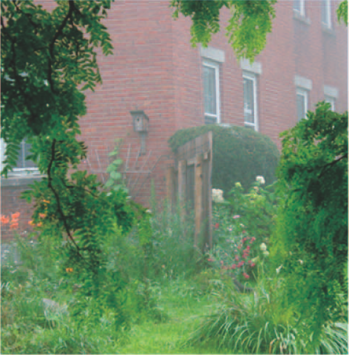

# 作业 1：图像去雾

## 1. 运行方式

在终端输入以下命令：

```shell
$ python .\haze_removal.py [file_name]
```

其中 `file_name` 为可选参数，表示需要去雾的图片所在路径。默认为 `./imgs/` 路径下的有雾图片。


## 2. 示例

以下图片左侧为有雾图片，右侧为暗通道先验算法去雾后图片。

示例 1：

<div>
    <center>
    	
    	
    </center>
</div>

示例 2：

<div>
    <center>
    	
    	
    </center>
</div>

示例 3：

<div>
    <center>
    	
    	
    </center>
</div>


## 3. 参考文献

[1] Kaiming He, Jian Sun, and Xiaoou Tang, “Single Image Haze Removal Using Dark Channel Prior,” IEEE Trans. Pattern Anal. Mach. Intell., vol. 33, no. 12, pp. 2341–2353, Dec. 2011, doi: 10.1109/TPAMI.2010.168.
