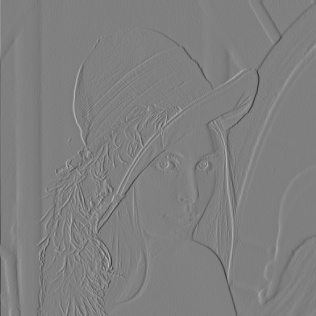
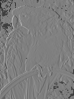

# 作业 6：DPCM 编码

## 1. 运行方式

在终端输入以下命令：

```shell
$ python .\dpcm.py image_path bit
```

其中 `image_path` 为必选参数，表示图片所在路径。`bit` 为必选参数，表示量化比特。


## 2. 示例

从左到右分别为原图、重建图、误差图。

### 2.1 Lenna.jpg

| bit  | PSNR  | SSIM  |
| :--: | :---: | :---: |
|  8   | 51.13 | 0.998 |
|  4   | 23.12 | 0.794 |
|  2   | 9.17  | 0.277 |
|  1   | 8.81  | 0.365 |

<div>
     8-bit  &nbsp; &nbsp;
    
    
    
</div>

<div>
     4-bit  &nbsp; &nbsp;
    
    
    
</div>

<div>
     2-bit  &nbsp; &nbsp;
    
    
    
</div>

<div>
     1-bit  &nbsp; &nbsp;
    
    
    
</div>


### 2.2 parrot.png

| bit  | PSNR  | SSIM  |
| :--: | :---: | :---: |
|  8   | 18.49 | 0.908 |
|  4   | 9.74  | 0.608 |
|  2   | 7.67  | 0.062 |
|  1   | 7.12  | 0.130 |

<div>
     8-bit  &nbsp; &nbsp;
    
    
    
</div>

<div>
     4-bit  &nbsp; &nbsp;
    
    
    
</div>

<div>
     2-bit  &nbsp; &nbsp;
    
    
    
</div>

<div>
     1-bit  &nbsp; &nbsp;
    
    
    
</div>
